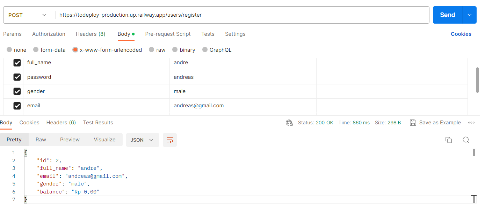
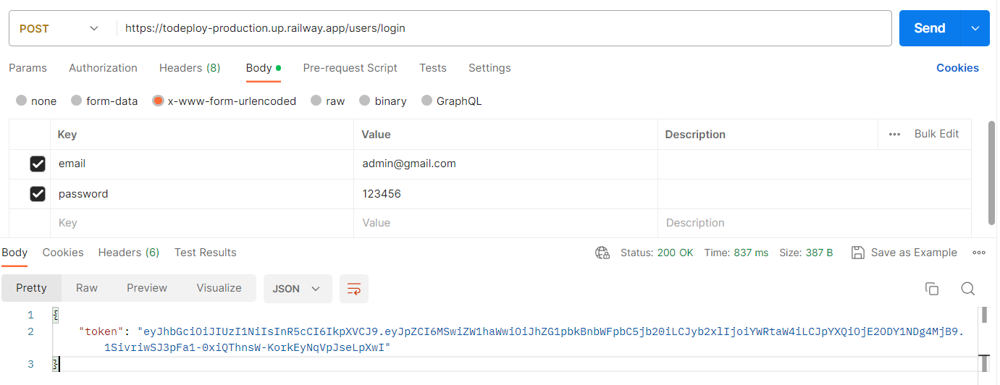

# Api Toko Belanja
## Link Railway
https://todeploy-production.up.railway.app/

To run this project, install it locally using npm:

```
npm install
npm run start (for migrate all)
npm run admin (for seeder admin)
```

## Available seed admin:
```json
{
   "email": "admin@gmail.com"
   "password": "123456"
}
```


## Notes
Sesuaikan `config` dengan database postgres device. <br>
Port dapat disesuaikan di `.env`

# Using Api
run api in `postman` 

## User

### Register
```
https://todeploy-production.up.railway.app/users/register
```


### Login
```
https://todeploy-production.up.railway.app/users/login
```

#### Token
* Token akan muncul ketika berhasil login
* Simpan token pada notepad untuk di gunakan pada feature berikutnya

### Edit
```
https://todeploy-production.up.railway.app/users/
```


### Delete
```
https://todeploy-production.up.railway.app/users/
```


## Acknowledgments

* Hat tip to anyone whose code was used
* Inspiration
* etc


