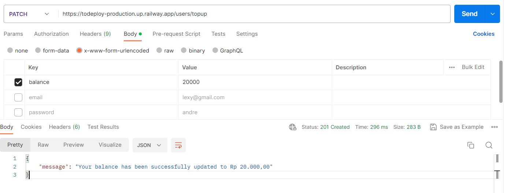

# Api Toko Belanja
## Link Railway
https://todeploy-production.up.railway.app/

To run this project, install it locally using npm:

```
npm install
npm run start (for migrate all)
npm run admin (for seeder admin)
```

## Available seed admin:
```json
{
   "email": "admin@gmail.com"
   "password": "123456"
}
```


## Notes
Sesuaikan `config` dengan database postgres device. <br>
Port dapat disesuaikan di `.env`

# Using Api
run api in `postman` 

## User

<br>
<br>


### POST /users/register
```
https://todeploy-production.up.railway.app/users/register
```
#### Data Register

```json
{
   "full_name": "andre",
   "email": "andreas@gmail.com",
   "password": "123456",
   "gender": "male"
}
```


<br>
<br>


### POST /users/login
```
https://todeploy-production.up.railway.app/users/login
```

```
pastikan method adalah post
```
#### Data Login   

```json
{
   "email": "andreas@gmail.com",
   "password": "123456",
}
```


#### Token
* Token akan muncul ketika berhasil login
* Simpan token untuk di gunakan pada feature berikutnya

<br>
<br>


### PUT /users
```
https://todeploy-production.up.railway.app/users/
```
#### Data Edit   
```json
{
   "full_name": "Andreas Nugroho",
   "email": "andreas@gmail.com",
}
```


#### Header Token


<br>
<br>


### DELETE /users
```
https://todeploy-production.up.railway.app/users/
```


#### Header Token


<br>
<br>


### PATCH /users/topup
```
https://todeploy-production.up.railway.app/users/topup
```
#### Data Topup   
```json
{
   "balance": 200000,
}
```


#### Header Token


